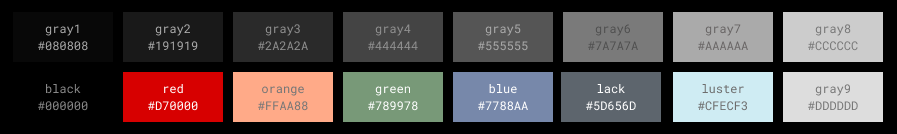

# how to use the lackluster dev tools!
> these tools are not required for development but they make life easier

## how to setup a dev env at a custom location
1. fork this repository
2. create a directory where you want to develop neovim plugins 
  * like `mkdir ~/code/neovim_dev`
3. add your directory to the vim runtime path
  * `vim.opt.runtimepath:append(',~/code/neovim_dev')`
4. clone your fork into your development direcotry
  * `cd ~/code/neovim_dev`
  * `git clone <your fork>`
5. load the dev lib and user commands
```lua
local lackluster_dev = require("lackluster.dev")
lackluster_dev.create_usercmds()
```

## how to setup dev env with lazy.nvim
1. fork this repository
2. create a directory where you want to develop neovim plugins
  * like `mkdir ~/code/neovim_dev`
3. add your directory to you lazy.nvim `setup()`
``` lua
require("lazy").setup(
    -- ...your config 
    {
        dev = {
            path = "~/code/neovim_dev",
        },
    },
)
```
4. clone your fork into your development direcotry
  * `cd ~/code/neovim_dev`
  * `git clone <your fork>`

5. setup your lazy plugin for lackluster to use `dev = true`
  * it will now look in your dev directory
```lua
-- setup your lazy plugin config with dev = true
return {
    "slugbyte/lackluster.nvim",
    lazy = false,
    dev = true,
    priority = 1000, -- make sure to load this before all the other start plugins
    init = function()
        local lackluster_dev = require("lackluster.dev")
        lackluster_dev.create_usercmds()
        vim.cmd.colorscheme("lackluster")
    end,
}
```

## COLOR NAMES
> don't let the main readme fool you, the actual color names are red, orange, green, and blue



## API
* `lackluster_dev.lackluster_reload()` - reload any changes made to lackluster
* `lackluster_dev.try_fg(hl_group, color_name)` - test out a lackluster color on a hl\_group
* `lackluster_dev.try_bg(hl_group, color_name)` - test out a lackluster color on a hl\_group
* `lackluster_dev.create_usercmds()` - create lack luster development user commands

## USER COMMANDS
* `:LLR` - reload lackluster
* `:LLFG <hl_group> <color_name>` - try a lackluster color on the foreground
* `:LLBG <hl_group> <color_name>` - try a lackluster color on background
