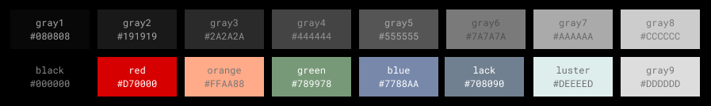

# LACKLUSTER DEVELOPMENT GUIDE

## GOALS
* Maximize code readability and minimize visual noise
* Make it easy to quickly visually identify...
  * Function and type definitions
  * Function return and exception points
  * Function calls
  * Builtin modules and functions
  * Diagnostic errors
* Support commonly used neovim plugins
* Be easy on the eyes

### NON GOALS
* light mode or other new themes (for now)

## SETUP DEVELOPMENT ENVIRONMENT

<details>

<summary>(RECOMMENDED) How to setup dev env with lazy.nvim</summary>

1. fork this repository
2. create a directory where you want to develop neovim plugins
  * like `mkdir ~/code/neovim_dev`
3. add your directory to you lazy.nvim `setup()`
``` lua
require("lazy").setup(
    -- ...your config 
    {
        dev = {
            path = "~/code/neovim_dev",
        },
    },
)
```
4. clone your fork into your development directory
  * `cd ~/code/neovim_dev`
  * `git clone <your fork>`

5. setup your lazy plugin for lackluster to use `dev = true`
  * it will now look in your dev directory
```lua
-- setup your lazy plugin config with dev = true
return {
    "slugbyte/lackluster.nvim",
    dependencies = {
        -- NOTE: plenary.nvim is required for lackluster_reload() to work
        "nvim-lua/plenary.nvim",
    },
    lazy = false,
    dev = true,
    priority = 1000, -- make sure to load this before all the other start plugins
    init = function()
        local lackluster = require("lackluster")
        lackluster.dev.create_usercmds()
        vim.cmd.colorscheme("lackluster")
    end,
}
```
</details>

<details>

<summary>How to setup a dev environment at a custom location</summary>

1. fork this repository
2. create a directory where you want to develop neovim plugins 
  * like `mkdir ~/code/neovim_dev`
3. add your directory to the vim runtime path
  * `vim.opt.runtimepath:append(',~/code/neovim_dev')`
4. clone your fork into your development directory
  * `cd ~/code/neovim_dev`
  * `git clone <your fork>`
4. use your package manager to install `nvim-lua/plenary.nvim` a dependency of
   `lackluster_reload()`
5. load the dev lib and user commands
```lua
local lackluster = require("lackluster")
lackluster.dev.create_usercmds()
```
</details>

## COLOR NAMES
> Don't let the main readme fool you, the actual color names are red, orange, green, and blue

> there are are also quite a few other colors that start with `_special_`
> that I ended up creating to ensure UIs consistently look good `¯\_(ツ)_/¯`



## (OPTIONAL) DEV API
> these can be useful for testing out ideas while adding new highlights to lackluster
* `lackluster_dev.lackluster_reload()` - reload any changes made to lackluster
* `lackluster_dev.try_fg(hl_group, color_name)` - test out a lackluster color\_name or a hexcode a hl\_group
  * hex codes need to start with `#` like `#99ffaa`
* `lackluster_dev.try_bg(hl_group, color_name)` - test out a lackluster color\_name or a hexcode on a hl\_group
  * hex codes need to start with `#` like `#99ffaa`
* `lackluster_dev.create_usercmds()` - create lack luster development user commands
  * `:LLR` - reload lackluster
  * `:LLF <hl_group> <color_name>` - try a lackluster color on the foreground
  * `:LLB <hl_group> <color_name>` - try a lackluster color on background

## How To Add Plugin Support
 1) create a plugin function in `lua/lackluster/plugin/plugin-name.lua`
 1) load the plugin function at the bottom of `lua/lackluster/highlight.lua`
 1) add plugin\_name to the `default_config.disable_plugin` in `lua/lackluster/init.lua`
 1) update the README disable\_plugin docs to include the new docs
 1) update the README link to the supported plugin

```lua
-- plugins should only have access to theme.lua not color.lua or color_special.lua
-- this is because I want to make it very easy to crate a light variant in the future
-- and I should only have to create a light_theme.lua file

local spec = require("lackluster.spec")

---@param theme LacklusterTheme
---@return LacklusterHighlightGroup
return function(theme)
    return {
        plugin_name = "plugin_name",
        highlight = {
          -- spec.co sets fg bg and options
          spec.co("HighlightNameA", theme.ui.fg_normal, theme.ui.bg_normal, {undercurl = true}),
          -- spec.fg sets only the fg
          spec.fg("HighlightNameB", theme.ui.fg_normal),
          -- spec.bg sets only the bg
          spec.bg("HighlightNameC", theme.ui.bg_normal),
          -- spec.op sets only options
          spec.op("HighlightNameD", {undercurl = true}),
          -- spec.ln links a highlight to another highlight 
          -- in this example HighlightNameE links to -> HighlightNameB
          spec.op("HighlightNameE", 'HighlightNameB'),
        },
    }
end
```

## colors in different forms for extra development
> pallet in (name) (hexcode) (rgb) (24bit termcode)

```txt 
[name] [hexcode] [rgb]              [termcode end]
reset                               \x1b[0m
lack   #708090   rgb(112, 128, 144) \x1b[38;2;112;128;144m
luster #deeeed   rgb(222, 238, 237) \x1b[38;2;222;238;237m
orange #ffaa88   rgb(255, 170, 136) \x1b[38;2;255;170;136m
green  #789978   rgb(120, 153, 120) \x1b[38;2;120;153;120m
blue   #7788AA   rgb(119, 136, 170) \x1b[38;2;119;136;170m
red    #D70000   rgb(215, 0, 0)     \x1b[38;2;215;0;0m
black  #000000   rgb(0, 0, 0)       \x1b[38;2;0;0;0m
gray1  #080808   rgb(8, 8, 8)       \x1b[38;2;8;8;8m
gray2  #191919   rgb(25, 25, 25)    \x1b[38;2;25;25;25m
gray3  #2a2a2a   rgb(42, 42, 42)    \x1b[38;2;42;42;42m
gray4  #444444   rgb(68, 68, 68)    \x1b[38;2;68;68;68m
gray5  #555555   rgb(85, 85, 85)    \x1b[38;2;85;85;85m
gray6  #7a7a7a   rgb(122, 122, 122) \x1b[38;2;122;122;122m
gray7  #aaaaaa   rgb(170, 170, 170) \x1b[38;2;170;170;170m
gray8  #cccccc   rgb(204, 204, 204) \x1b[38;2;204;204;204m
gray9  #DDDDDD   rgb(221, 221, 221) \x1b[38;2;221;221;221m
```
