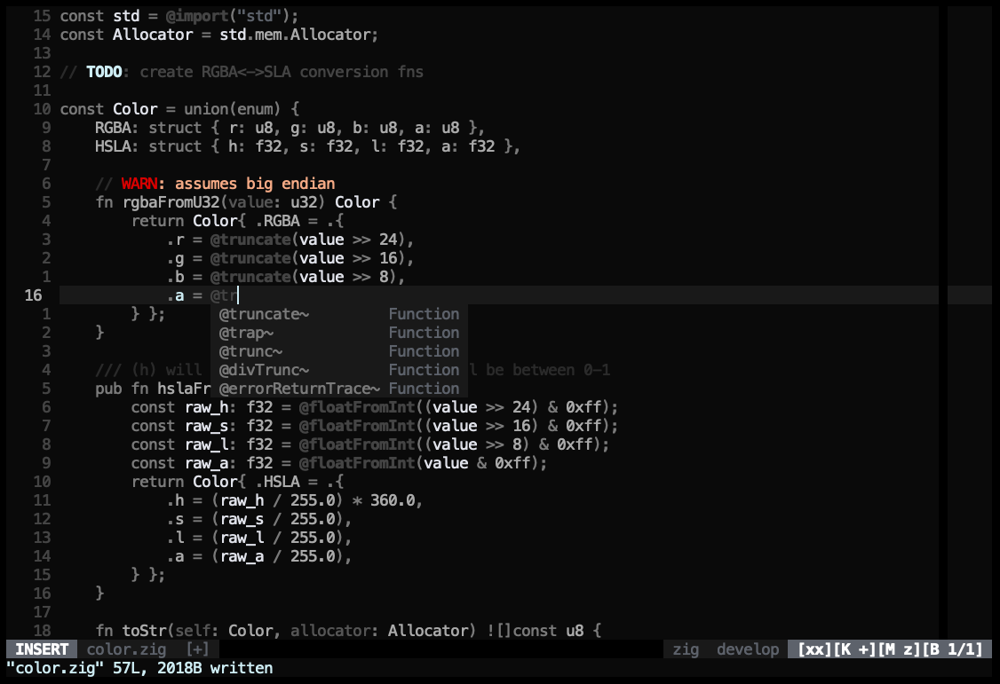
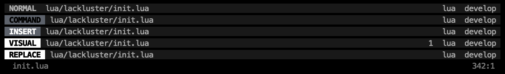
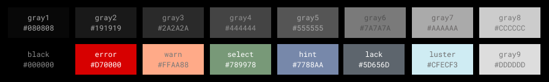

# lackluster
> a delightful mostly grayscale colorscheme thats soft on the eyes, and supports heaps of plugins





> a minimal but flexible and good looking pallet made from beautiful hexcodes



[a bunch more screenshots...](./SCREENSHOT.md)

## INSTALL
1. Install `slugbyte/lackluster.nvim` with your favorite package manager
2. Set your colorscheme to `lackluster`

```lua 
-- example lazy.nvim install setup
return {
    "slugbyte/lackluster.nvim",
    lazy = false,
    priority = 1000,
    init = function()
        vim.cmd.colorscheme("lackluster")
    end,
}
```

#### LUALINE SETUP
```lua
require('lualine').setup({
    options = {
        theme = "lackluster",
    },
})
```

#### EXPLICITLY SUPPORTED PLUGINS
> lots of other plugins should work right out of the box too!
* [figet.nvim](https://github.com/j-hui/fidget.nvim)
* [gitsigns.nvim](https://github.com/lewis6991/gitsigns.nvim)
* [lazy.nvim](https://github.com/folke/lazy.nvim)
* [lualine.nvim](https://github.com/nvim-lualine/lualine.nvim)
* [mason.nvim](https://github.com/williamboman/mason.nvim)
* [mini.diff](https://github.com/echasnovski/mini.diff)
* [nvim-lightbulb](https://github.com/kosayoda/nvim-lightbulb)
* [nvim-lspconfig](https://github.com/neovim/nvim-lspconfig)
* [nvim-tree.lua](https://github.com/nvim-tree/nvim-tree.lua/tree/master?tab=readme-ov-file)
* [nvim\_cmp](https://github.com/hrsh7th/nvim-cmp)
* [oil.nvim](https://github.com/stevearc/oil.nvim)
* [telescope.nvim](https://github.com/nvim-telescope/telescope.nvim)
* [todo-comments.nvim](https://github.com/folke/todo-comments.nvim)
* [trouble.nvim](https://github.com/folke/trouble.nvim)
* [vim-gitgutter](https://github.com/airblade/vim-gitgutter)
* [which-key.nvim](https://github.com/folke/which-key.nvim)

## SELF-PROMO
If you like this project star the GitHub repository :)

## HELP WANTED
If you find in bugs, or syntax issues feel free to open a ticket!

Is `lackluster` missing support for a plugin you love? Feel free to open a PR with a
suggested implementation! Your contribution is mega much appreciated.

See the [CONTRIBUTING](./CONTRIBUTING.md) and [DEVELOPMENT](./DEVELOPMENT.md) Guides!

### ACKNOWLEDGEMENT
> I referenced the following colorschemes when creating lackluster
* [folke/tokyonight.nvim](https://github.com/folke/tokyonight.nvim/tree/main)
* [nyoom-engineering/oxocarbon.nvim](https://github.com/nyoom-engineering/oxocarbon.nvim)
* [rose-pine/neovim](https://github.com/rose-pine/neovim)
