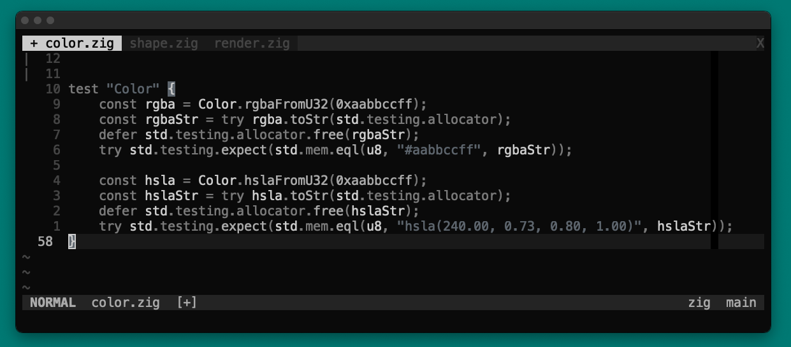
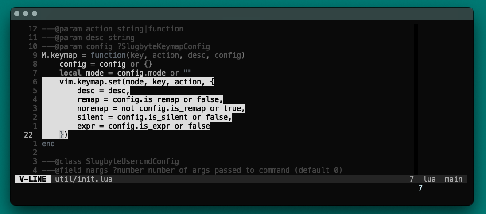
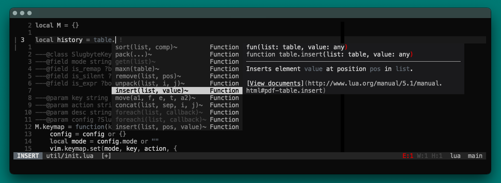
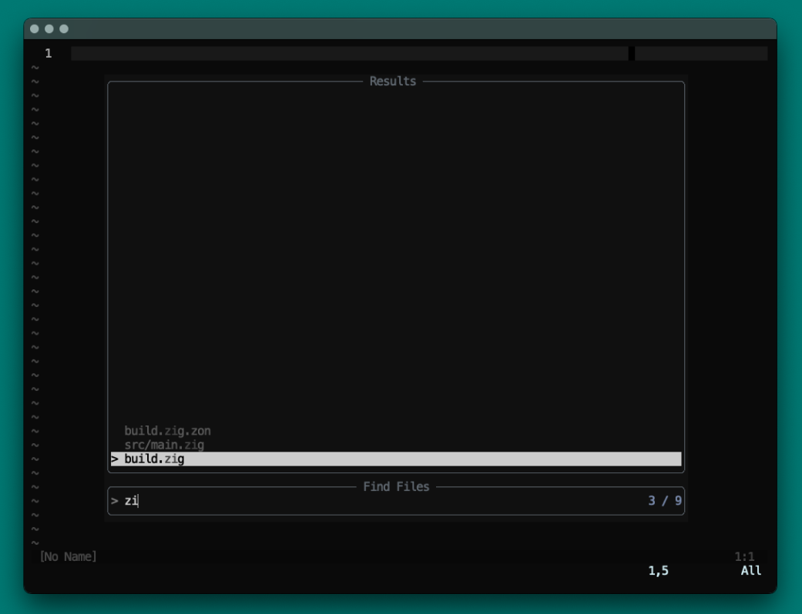
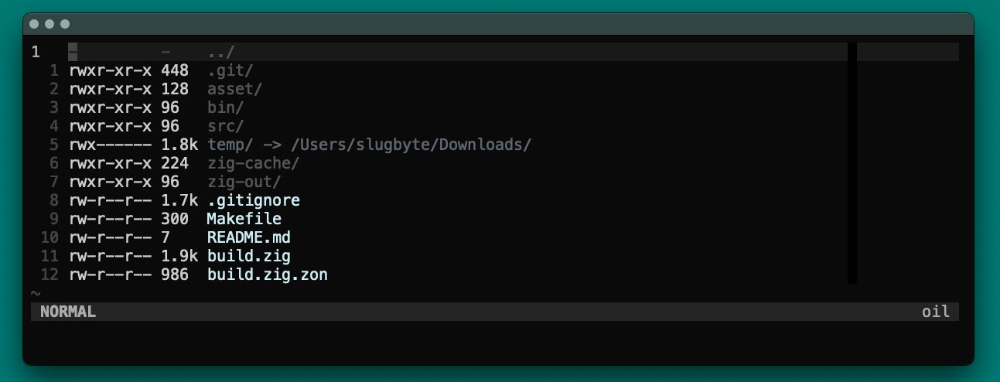
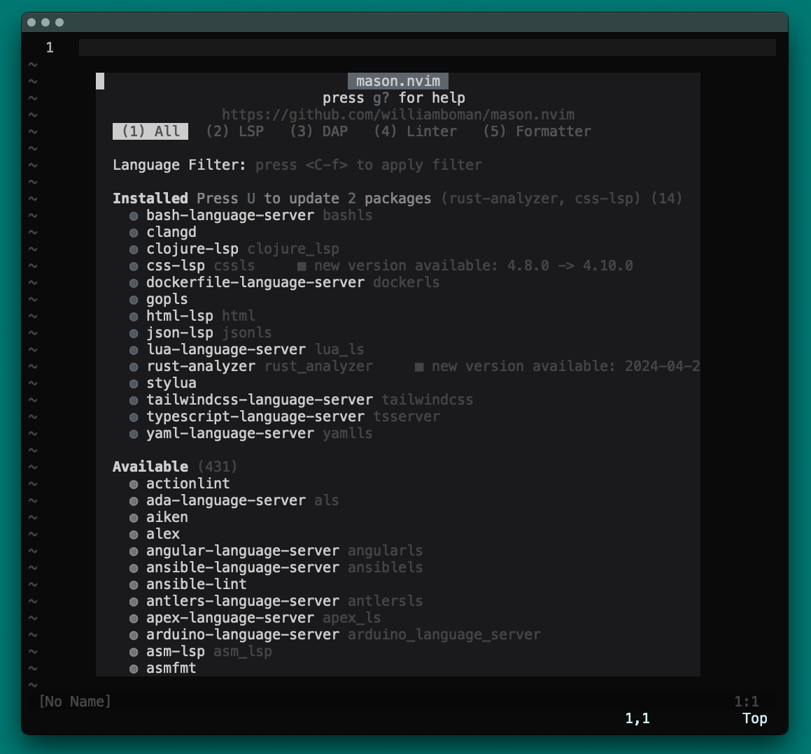

## lualine
>  the statusline with a dark background is used for out of focus

## lackluster tabs

## visual select

## nvim_cmp
> darker gray options are deprecated

## telescope.nvim
> with preview

> without preview

> fuzzy search buffer

## nvim-tree-lua

## oil.nvim

## lazy.nvim

## mason.nvim

## which-key.nvim

## todo-comment.nvim

