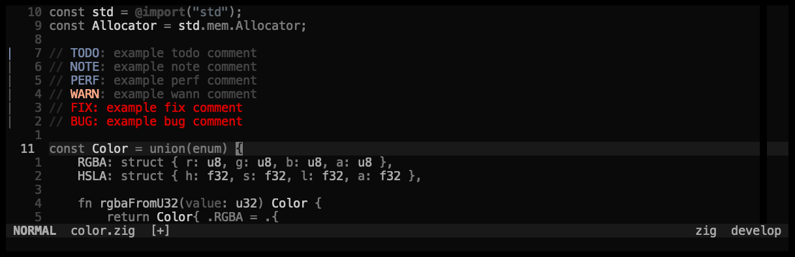

## pallet
> a minimal but flexible and good looking pallet made from beautiful hex codes

# lackluster

## lualine

## visual select

## telescope.nvim

## nvim_cmp
> darker gray options are deprecated

## which-key.nvim

## lazy.nvim

## todo-comment.nvim

