# LACKLUSTER SCREENSHOTS

## NAV
* [plugin highlights](#plugin)
* [neovim highlights](#neovim)
* [lackluster variations](#lackluster-variations)
* [lackluster experimental variations](#experimental-variations)

## PLUGIN
### lualine
> the statusline with a dark background is used for out of focus

### nvim_cmp
> darker gray options are deprecated

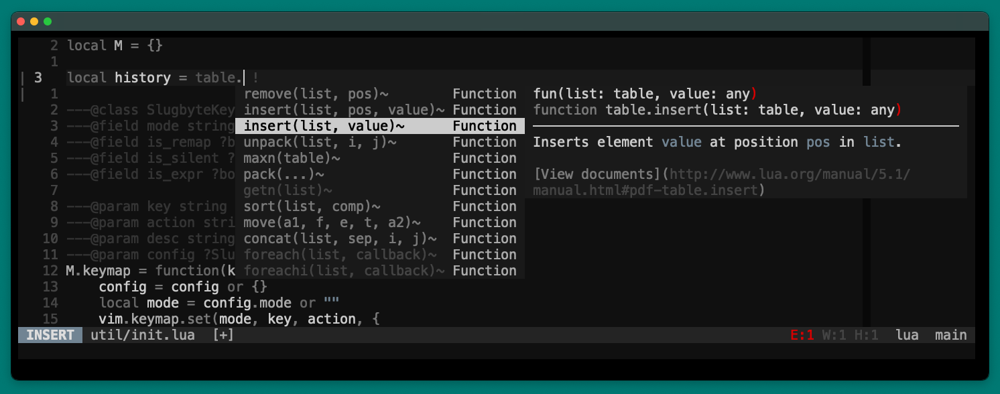

### telescope.nvim
> telescope without preview

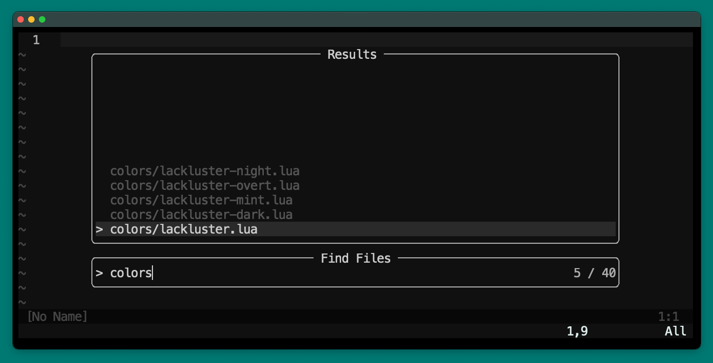
> telescope with preview

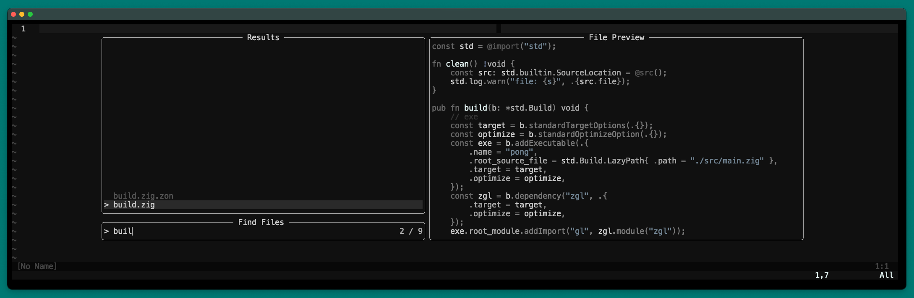
> telescope with drop-down

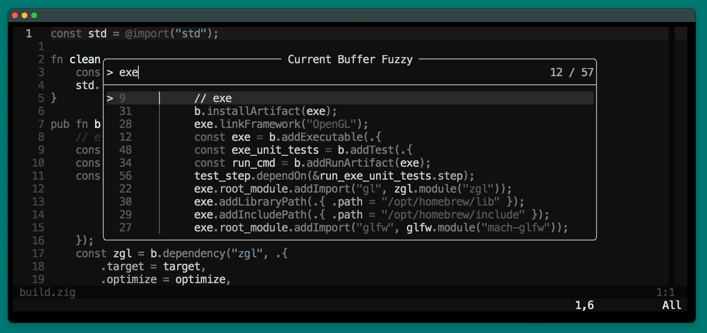

### nvim-tree-lua
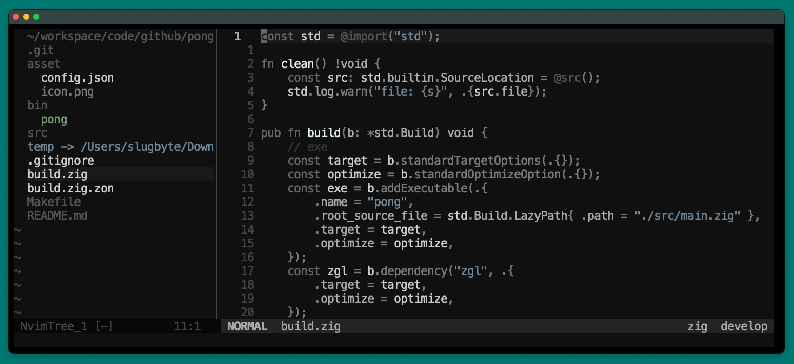

### oil.nvim
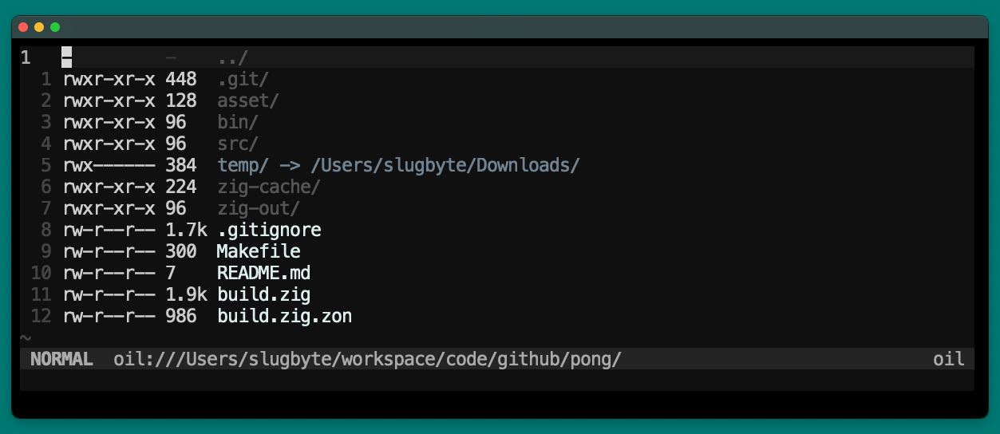

### lazy.nvim
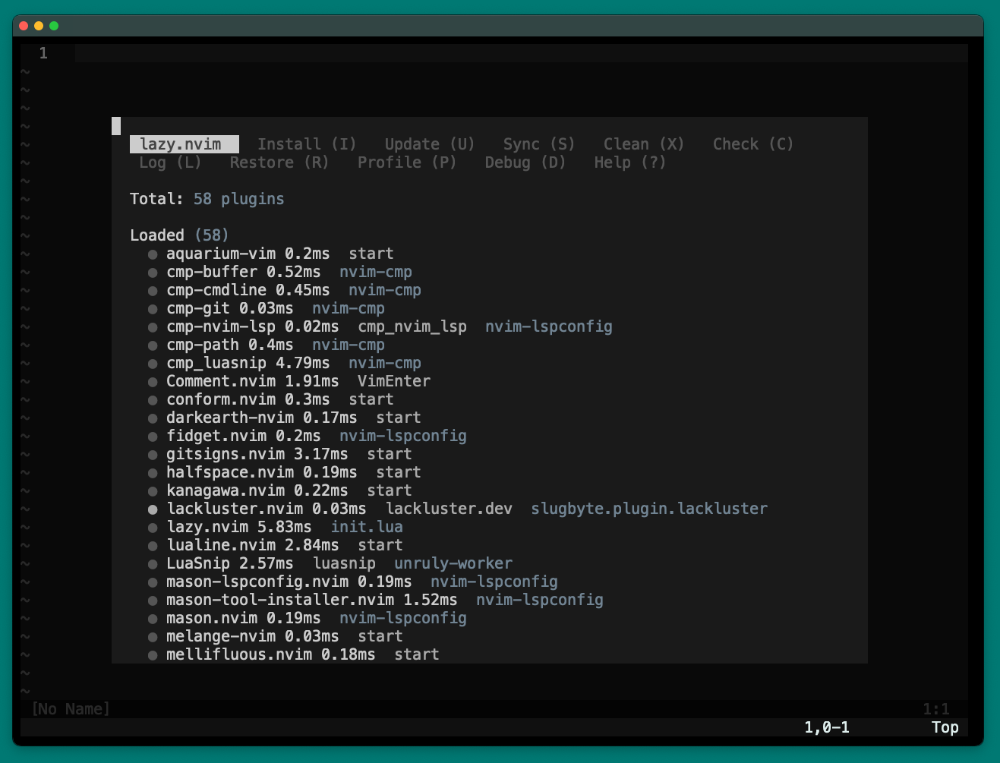

### mason.nvim

### which-key.nvim
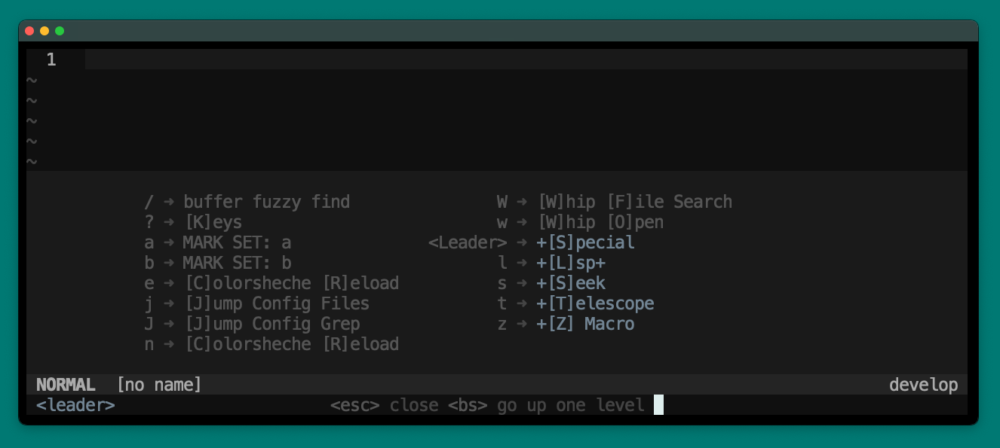

### todo-comment.nvim
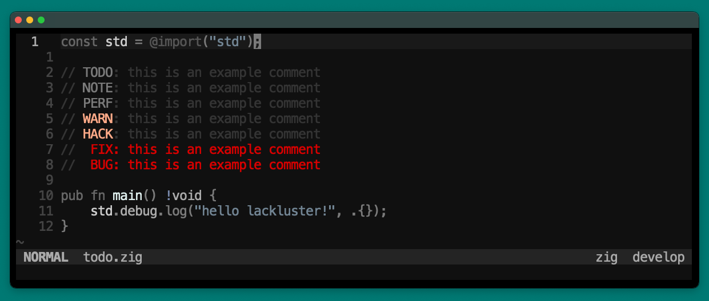

## NEOVIM
### lackluster tabs
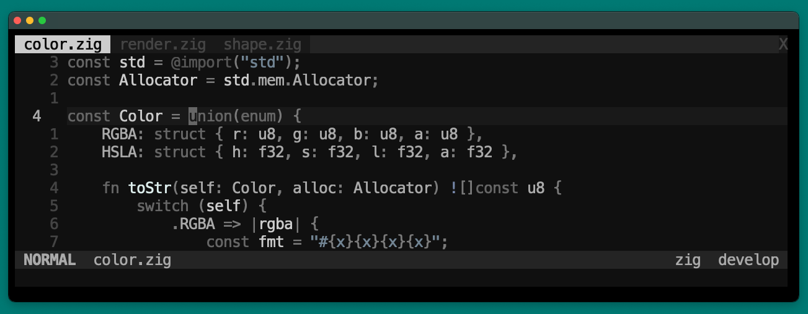

### visual select
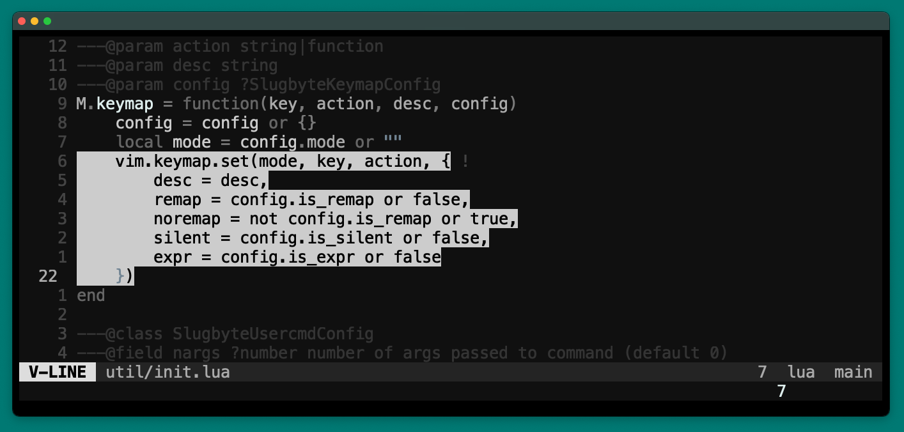

## LACKLUSTER VARIATIONS

> lackluster (default)

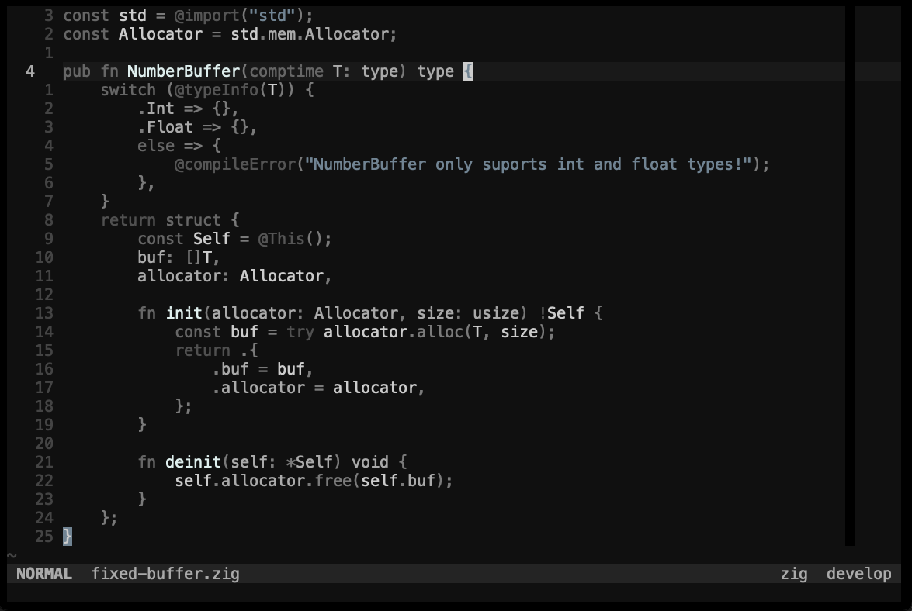

> lackluster-hack (return is green, exception is blue)

> lackluster-mint (types are green)

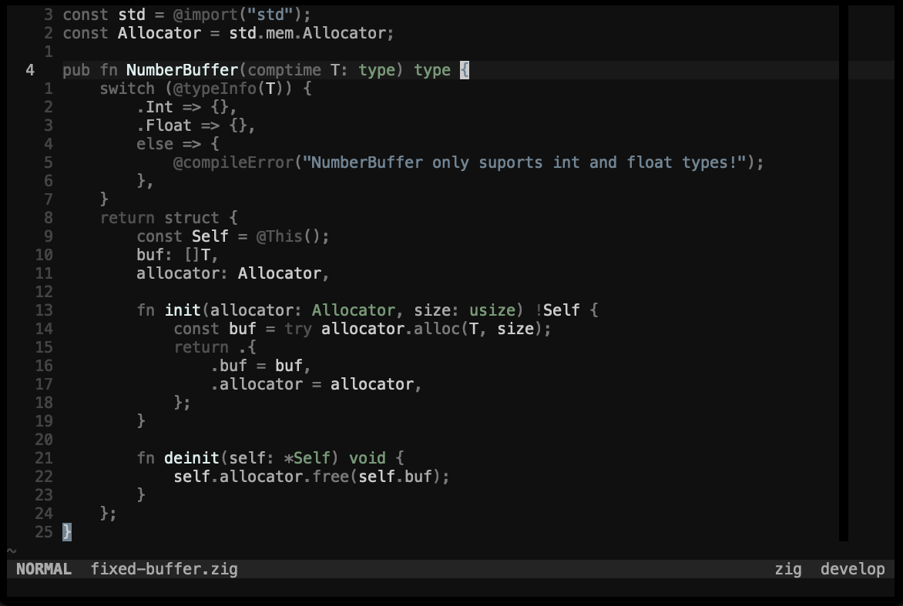

## EXPERIMENTAL VARIATIONS
Experimental variations may be deprecated soon, I am having trouble making them look as
good as I want them to be and don't want to spend to much more time on them :)

> (experimental) lackluster-night

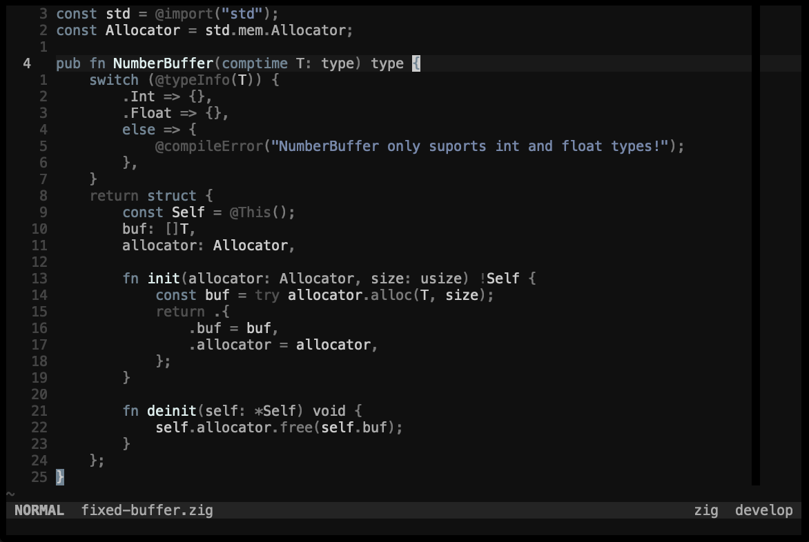

> (experimental) lackluster-dark

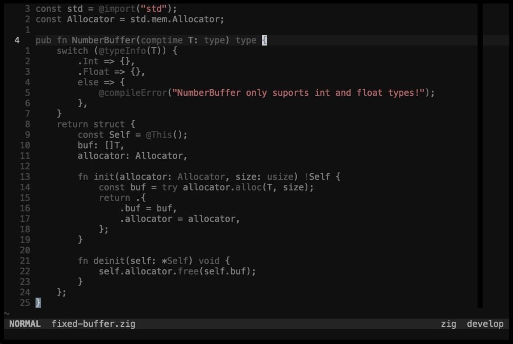

